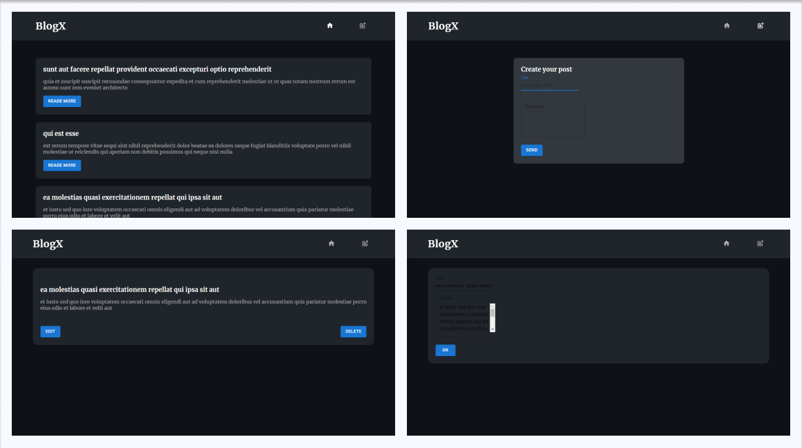

# BlogX

Desenvolvi uma aplicação de página única (SPA) de blog que consome uma fakeAPI (JSONPlaceholder). Embora não seja possível criar, editar ou excluir artigos de fato, a aplicação simula essas ações. O principal objetivo é praticar o uso dos métodos HTTP (GET, POST, PUT, DELETE) por meio da biblioteca Axios.

O projeto é de minha autoria e foi inspirado em outras aplicações existentes, adaptando seus designs e recursos. A aplicação foi construída utilizando as tecnologias TypeScript, React, Styled Components e Material-UI (MUI). Estou satisfeito com o resultado alcançado: 💻<https://blogx-flame.vercel.app/>.

