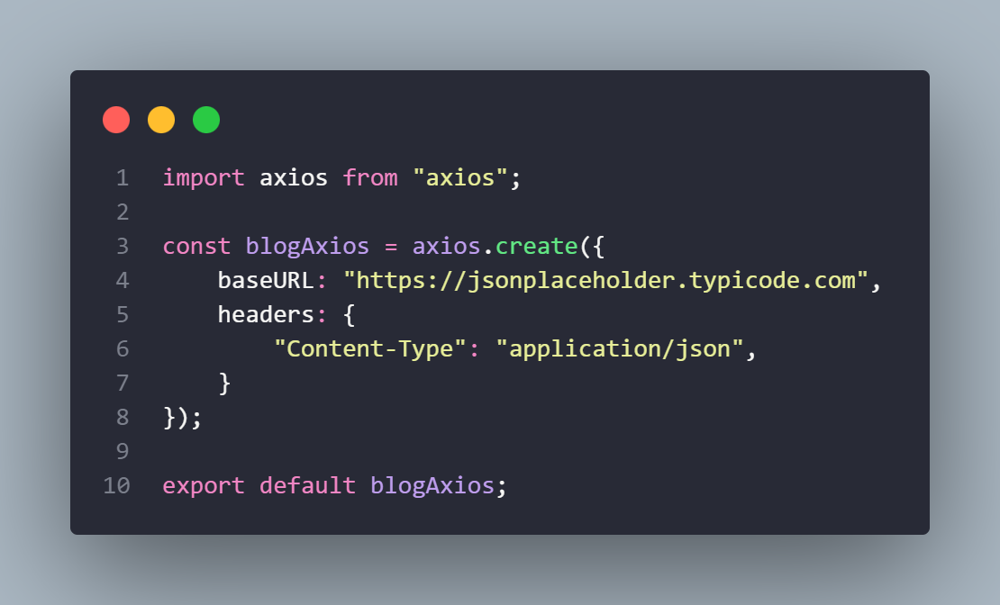
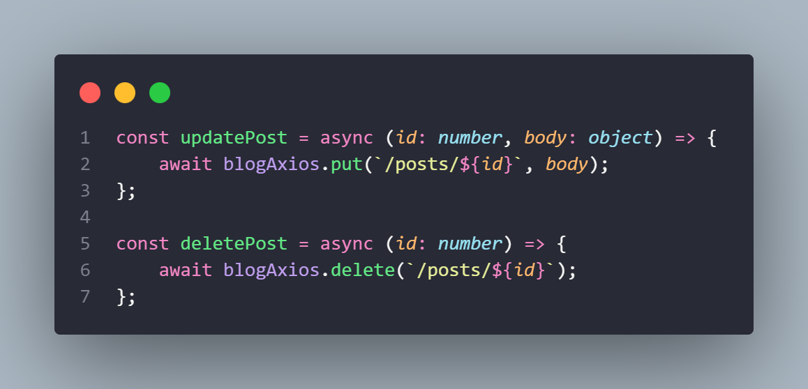

# BlogX

Desenvolvi uma aplicação de página única (SPA) de blog que consome uma fakeAPI (JSONPlaceholder). Embora não seja possível criar, editar ou excluir artigos de fato, a aplicação simula essas ações, tendo como finalidade principal praticar o uso dos métodos HTTP (GET, POST, PUT, DELETE) por meio da biblioteca Axios.

O projeto é de minha autoria e foi inspirado em outras aplicações existentes, adaptando seus designs e recursos. A aplicação foi construída utilizando as tecnologias TypeScript, React, Styled Components e Material-UI (MUI). Estou satisfeito com o resultado alcançado: 💻<https://blogx-flame.vercel.app/>.

 

## 🎯 Objetivos

> - Avaliar o layout ideal da interface, considerando as dimensões da tela do dispositivo
> - Visualizar os estados de "hover" e "focus" para todos os elementos interativos presentes na página
> - Simular operações de criação, edição e exclusão de artigos

Estes objetivos visam principalmente criar um repositório prático para a aplicação dos métodos HTTP (GET, POST, PUT, DELETE), utilizando a biblioteca Axios. Essas operações serão realizadas por meio da fakeAPI JSONPlaceholder.

 

## 🔧 Propriedades e Tecnologias

> - Vite
> - TypeScript
> - React
> - React Router DOM v6
> - React Context API
> - Styled Components
> - Axios
> - Material-UI (MUI)
> - FakeAPI (JSONPlaceholder)

 

## 🧠 Meu aprendizado

> - Axios
> - Styled Components
> - Material-UI (MUI)

Este projeto teve um grande impacto no meu conhecimento, pois me introduziu aos conceitos fundamentais do Material-UI e Styled Components, ao mesmo tempo em que aprofundei minhas habilidades nas requisições HTTP. No entanto, este artigo se concentrará principalmente em discutir os conceitos relacionados à biblioteca Axios.

O Axios é um cliente HTTP amplamente utilizado para realizar requisições de rede em ambientes JavaScript, sendo aplicável tanto no navegador quanto em plataformas de servidor como o Node.js. Reconhecido por sua simplicidade e eficiência, o Axios simplifica a comunicação entre aplicações e servidores, oferecendo uma interface amigável para enviar solicitações HTTP, lidar com respostas e gerenciar interceptadores de requisição e resposta.

De acordo com a documentação, seguir a prática de criar uma instância de configuração é altamente recomendado. O método "create" oferece a flexibilidade de estabelecer padrões, como a definição da baseURL e headers. Isso não apenas evita a repetição de código, mas também simplifica nosso trabalho, permitindo um foco direto nos endpoints. No exemplo acima, optamos por nomear a instância de "blogAxios".

Dessa forma, ao utilizarmos a instância "blogAxios", ganhamos acesso aos métodos como GET, POST, PUT, DELETE, entre outros. Para fazer uso desses métodos, é necessário fornecer o endpoint como argumento e, em alguns casos, um objeto "body" para efetuar modificações.

[saiba mais!](https://axios-http.com/ptbr/docs/config_defaults)

 

## 💻 Rodando o projeto

Para conferir a versão final é só acessar o link: 💻<https://blogx-flame.vercel.app/>.

 

## Autor

- LinkedIn - [Pedro A. Lima](https://www.linkedin.com/in/pedroalima6/)